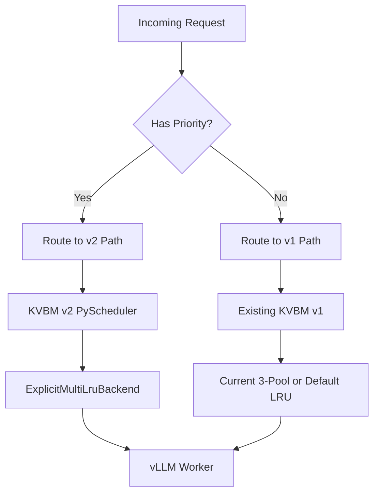

```mermaid
graph TB
    A[Incoming Request] --> B{Has Priority?}
    B -->|Yes| C[Route to v2 Path]
    B -->|No| D[Route to v1 Path]
    C --> E[KVBM v2 PyScheduler]
    E --> F[ExplicitMultiLruBackend]
    D --> G[Existing KVBM v1]
    G --> H[Current 3-Pool or Default LRU]
    F --> I[vLLM Worker]
    H --> I
```